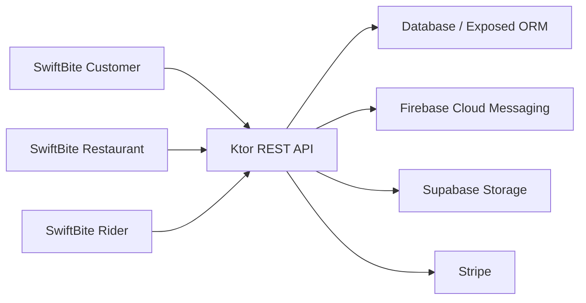
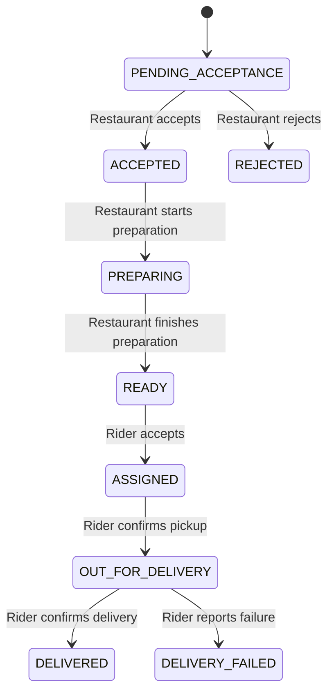

# SwiftBite Architecture

## Overview

SwiftBite uses one Android application module with product flavors. Shared functionality lives in `app/src/main`; role-specific screens and entry activities live in flavor source sets.

```text
app/src/main        Shared data, networking, auth, notifications, navigation, UI system
app/src/customer    Customer activity and customer-only features
app/src/restaurant  Restaurant activity and owner features
app/src/rider       Rider activity and delivery features
```

The three generated apps communicate with the same REST backend.



## Android layers

### UI

Jetpack Compose screens render immutable state and send user actions to ViewModels. Shared components provide headers, state panes, status pills and shimmer placeholders.

### ViewModel

ViewModels expose `StateFlow` UI state and `SharedFlow` one-time events. They own loading, retry, validation and navigation decisions but do not render UI.

### Network and session

`FoodApi` declares Retrofit endpoints. `NetworkModule` provides Retrofit, OkHttp and session dependencies. The interceptor adds:

- `Authorization: Bearer <JWT>` when signed in
- `X-Package-Name` so the backend can validate the requested role

`safeApiCall` converts Retrofit results into shared success, HTTP-error and exception states. HTTP 401 is standardized as an expired session.

### Dependency injection

Hilt constructs API, session, notification and ViewModel dependencies. Activities and Firebase services are Android entry points.

## Navigation

Navigation Compose uses serializable typed destinations. Each flavor defines a role-appropriate graph while sharing authentication, notification and common route types.

Notification intents carry an order ID. `BaseFoodHubActivity` processes new intents and forwards order navigation events to the active flavor.

## Order workflow



The restaurant uses `/restaurant-owner/orders/{orderId}/status`. The server verifies that the order belongs to the authenticated owner and validates the next state. Rider endpoints verify rider assignment before modifying delivery status.

## Notifications

Important transitions create stored notifications and may send FCM messages. The Android notification inbox fetches stored notifications, supports read state and opens order details when an order ID exists.

## Images

Restaurant menu images are selected through the Android system picker and uploaded as multipart content to Ktor. The backend compresses the image, uploads it to Supabase Storage and returns a public URL saved with the menu item.

## Themes and accessibility

Each flavor has light and dark Material 3 palettes:

- Customer: coral, cream and mustard
- Restaurant: sky blue and blue-charcoal
- Rider: teal, mint and amber

Status chips combine text, semantic color and icons so meaning does not depend only on color. Rider actions use minimum 56dp targets and bottom placement for one-handed operation.

## Backend organization

The Ktor project separates:

- Routes: HTTP parsing, authentication and responses
- Services: business rules and database transactions
- Models: serialized request/response contracts
- Tables: Exposed database definitions
- Integrations: Firebase, Stripe, Supabase and optional geocoding support

## Design trade-offs

- Addresses use manual entry to avoid Maps billing and runtime location permission.
- Live tracking was removed from the Android product scope; backend tracking code may remain but is unused.
- Restaurant analytics uses real order data and Compose Canvas rather than a chart dependency.
- Shimmer and success animations use Compose-native animation to avoid external asset dependencies.

